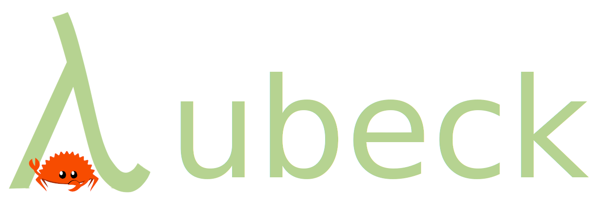

    

# Goals
This repository tries to continue the work started in
[JasonShin's](https://github.com/JasonShin) crate
[fp-core.rs](https://github.com/JasonShin/fp-core.rs).

The goal of this repository is to make concepts from functional languages like
Haskell available in Rust in form of a library while keeping them as
easy-to-use as possible.

A secondary goal is the creation of an accompanying book. This book will not
only document the library and its components but at the same serves as a
learning resource. It is meant to be used by people who want to get their feet
wet with functional programming in general and have no prior experience.

# Similar crates 

While searching for similar crates I stumbled upon these honorable mentions
(which seem to be unmaintained unfortunately):

- [fp-core.rs](https://github.com/JasonShin/fp-core.rs)
- [haskell_bits](https://github.com/clintonmead/haskell_bits)
- [frunk](https://github.com/lloydmeta/frunk)
- [functional](https://crates.io/crates/functional/0.0.7)
